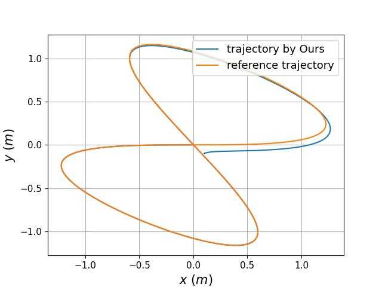
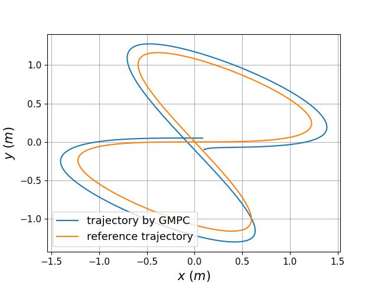
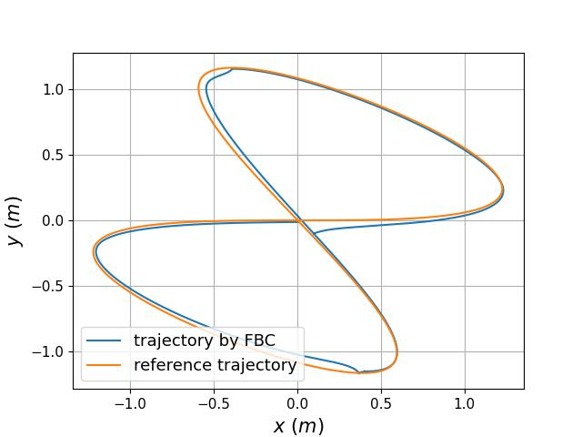
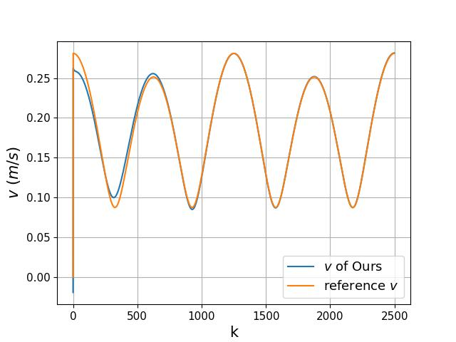
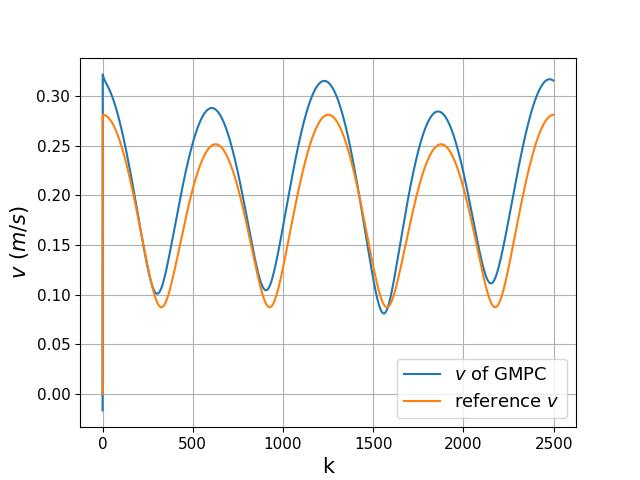
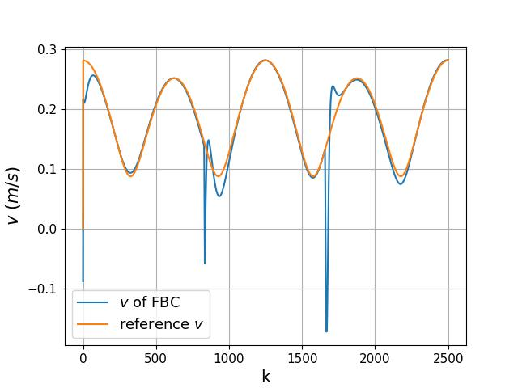
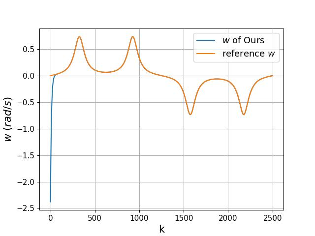
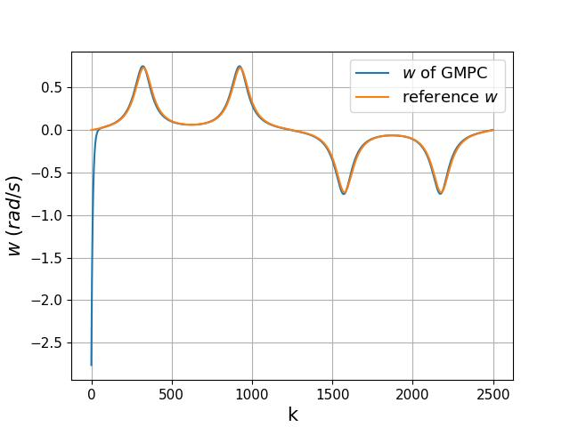
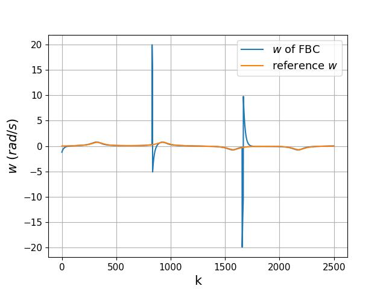

<div id="top" align="center">

# [Lie-algebra Learning for Differential Wheeled Robots Tracking Control with Model Uncertainty]()

</div>

## Introduction
This is the official code repository of "**Lie-algebra Learning for Differential Wheeled Robots Tracking Control with Model Uncertainty**", , which is accepted by IEEE CASE'25.


This work combines the Lie-algebra tracking formulation and adaptive dynamic programming and proposes a geometric consistent 
learning method for differential wheeled robots to handle model uncertainty. Simulation experiments validate the efficiency of the proposed method and demonstrate the advantages of our control method over existing approaches.


[//]: # ([preprint]&#40;https://arxiv.org/abs/2403.07317&#41;, [code]&#40;https://github.com/Garyandtang/GMPC-Tracking-Control&#41;)


[//]: # (If you find this work useful, please consider citing our paper:)

[//]: # ()
[//]: # (```)

[//]: # (@misc{tang2024gmpc,)

[//]: # (      title={GMPC: Geometric Model Predictive Control for Wheeled Mobile Robot Trajectory Tracking}, )

[//]: # (      author={Jiawei Tang and Shuang Wu and Bo Lan and Yahui Dong and Yuqiang Jin and Guangjian Tian and Wen-An Zhang and Ling Shi},)

[//]: # (      year={2024},)

[//]: # (      eprint={2403.07317},)

[//]: # (      archivePrefix={arXiv},)

[//]: # (      primaryClass={eess.SY})

[//]: # (})

[//]: # (```)


### Installation
1. clone the repository:
```bash
git clone https://github.com/Garyandtang/Lie-algebra-Learning-for-Differential-Wheeled-Robots-Tracking-Control.git
cd Lie-algebra-Learning-for-Differential-Wheeled-Robots-Tracking-Control
```
2. create a virtual environment
```bash
conda create -n lie-learning-dwr python=3.11
conda activate lie-learning-dwr
```
3. install the dependencies:
```bash
pip install -r requirements.txt
```
4. install the [manif](https://github.com/artivis/manif) library:
```bash
conda install -c conda-forge manifpy
```

5. Run the following command to test the proposed method in the simulation environment:
```bash
cd adaptive_tracking_control
python main_single_learning.py
```

6. Run the following command to compare the proposed method with baseline learning methods:
```bash
cd adaptive_tracking_control
python main_monte_carlo.py
```


### Time-vary Tracking Results Visualization

Ours        |                                           GMPC                                            | FBC
:-------------------------:|:-----------------------------------------------------------------------------------------:|:----------------------------------------
  |  |          
  |           |          
  |           |          


#### Thanks
We would like to thank the authors of the following repositories for their excellent work:
1. [robust-adaptive-lqr](https://github.com/modestyachts/robust-adaptive-lqr)
2. [manif](https://github.com/artivis/manif)
